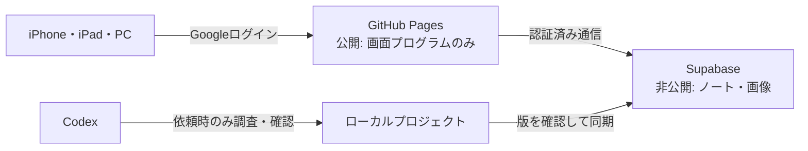

# 放射線技師ナレッジノート 要件仕様書

- 文書状態: 基本仕様確定
- 版: 1.0
- 作成日: 2026-08-19
- 仮称: 放射線技師ナレッジノート
- 対象: 個人利用限定
- プロジェクト: `/Volumes/codexdev/radiology-notes-web`

## 1. 目的

放射線技師として調べた知識を一か所へ蓄積し、iPhone・iPadから素早く検索・閲覧・編集できる個人用Webアプリを作る。

文章、WebページURL、画像をCodexへ渡した場合は、Codexが必要な調査、参考画像探索、ファクトチェック、分類を行ってアプリへ反映する。Webアプリからは、本人が直接ノートを作成・編集できるようにする。

## 2. 確定方針

- iPhone・iPadのSafariで利用できるレスポンシブPWAとする。
- 自宅、職場、外出先から通常のURLでアクセスできるようにする。
- Googleログインを使い、許可した本人のGoogleアカウントだけがデータへアクセスできるようにする。
- アプリ画面は明るいテーマとし、ホーム画面では検索を最も目立たせる。
- WebアプリとCodexプロジェクトの双方からノートを追加できるようにする。
- AIによる常時自動処理は行わない。調査、画像探索、ファクトチェックは本人がCodexへ依頼した時だけ行う。
- Codexが作成した内容はファクトチェック後に公開し、追加の本人承認操作は必須としない。
- Webから本人が直接作成・編集した内容は、そのまま保存・公開できる。
- ノート本文、画像、個人設定は公開リポジトリへ含めない。
- GitHub PagesとSupabase Freeを使い、初期運用費を月額0円にする。
- 患者情報、社外秘、院内限定資料、院外持ち出し禁止情報は扱わない。

## 3. 初期リリース範囲

### 3.1 含める機能

- Googleログインと本人アカウント限定アクセス
- ノートの一覧・詳細表示
- ノートの新規作成・編集・下書き・公開・アーカイブ
- 文章、WebページURL、画像の登録
- キーワード検索
- モダリティ、解剖部位、テーマ、自由タグの複合分類・絞り込み
- 関連ノートへのリンク
- 出典とファクトチェック情報の表示
- 外部画像とAI作成模式図の掲載
- お気に入り登録
- お気に入りと最近閲覧したノートのオフライン閲覧
- Markdown形式での書き出しとバックアップ
- Codex作業用の受け入れ箱と同期手順

### 3.2 初期リリースに含めない機能

- AI APIによる常時自動調査・自動公開
- メール通知、プッシュ通知
- オフライン中の作成・編集
- 複数利用者、共有、コメント、共同編集
- 患者情報、検査記録、DICOMデータの保存
- 既存ノートの一括移行
- 暗記カード、チェックリスト、撮影条件計算
- 独自ドメイン
- MRIシーケンスや詳細撮影条件の一律登録

## 4. 利用者と利用環境

- 利用者は本人1名とする。
- 主対象はiPhone SafariとiPad Safariとする。
- PCブラウザからも管理・編集できるレスポンシブ構成とする。
- PWAとしてホーム画面へ追加できるようにする。
- URLは `https://<GitHubユーザー名>.github.io/<リポジトリ名>/` 形式とする。
- GitHub Pagesのアプリコードは公開されるが、未ログイン時はノート、画像、検索結果を取得・表示しない。

## 5. 主要利用フロー

### 5.1 Codexから追加する

1. 会話で文章、URL、画像をCodexへ渡すか、プロジェクトの受け入れ箱へ置く。
2. 本人がノート化・調査・反映をCodexへ依頼する。
3. Codexが内容を整理し、分類、出典、参考画像候補を追加する。
4. Codexが日本語・英語の信頼できる資料でファクトチェックする。
5. 合格した内容を「Codex確認済み」としてSupabaseへ同期・公開する。
6. 根拠不足、出典矛盾、画像の権利問題がある部分は「要確認」として公開を保留する。

### 5.2 Webアプリから追加・編集する

1. Googleアカウントでログインする。
2. 新規ノートを開き、文章、URL、画像、分類を入力する。
3. 下書き保存または公開を選ぶ。
4. 内容は「本人編集」として保存する。
5. 後からCodexへ確認を依頼した場合は、調査後に「Codex確認済み」へ変更する。

### 5.3 閲覧する

1. ホーム画面の検索欄へキーワードを入力する。
2. 必要に応じてモダリティ、部位、テーマ、タグで絞り込む。
3. ノート詳細で本文、図、出典、確認状態、関連ノートを見る。
4. 頻繁に見るノートはお気に入りへ登録する。

## 6. 画面仕様

### 6.1 ログイン

- アプリ仮称とGoogleログインボタンを表示する。
- 未認証時にノートデータを先読みしない。
- 許可リスト外のGoogleアカウントはログイン後ただちに拒否する。

### 6.2 ホーム

- 画面上部に大きな検索欄を配置する。
- 検索欄の下に「最近更新」「お気に入り」「要確認」を表示する。
- モダリティ、解剖部位、テーマへの導線を配置する。
- 右下または操作しやすい位置に新規作成ボタンを置く。

### 6.3 検索・一覧

- タイトル、要約、本文、タグ、出典名を横断検索する。
- モダリティ、解剖部位、テーマ、タグを複数組み合わせて絞り込める。
- 結果にはタイトル、要約、分類、更新日、確認区分を表示する。
- 並び順は関連度、更新日、タイトルから選べる。

### 6.4 ノート詳細

- タイトル、要約、本文、画像、分類、出典、関連ノートを表示する。
- 「本人編集」「Codex確認済み」「要確認」を識別できる表示にする。
- Codex確認済みの場合は最終確認日と根拠資料を表示する。
- AI生成画像には「AI作成模式図」と明記する。
- お気に入り、編集、アーカイブ操作を配置する。
- 撮影条件は施設、装置、患者条件で異なる旨を共通注記として表示する。

### 6.5 ノート編集

- 本人がMarkdownを意識せず使える書式ツールバーとプレビューを用意する。
- 見出し、箇条書き、表、強調、リンク、画像に対応する。
- タイトル、要約、本文、分類、タグ、出典、画像を編集できる。
- 下書き保存と公開保存を選べる。
- 変更履歴を残し、直前の版へ戻せるようにする。

### 6.6 お気に入り・オフライン

- お気に入りと最近閲覧したノートを一覧表示する。
- オフライン保存済みか、最終同期がいつかを表示する。
- オフライン時は閲覧のみとし、編集ボタンを無効化する。
- ログアウト時に端末内のオフラインデータを消去する。

### 6.7 管理・状態

- 同期日時、同期エラー、競合、リンク切れ候補を表示する。
- 要確認ノートを理由別に一覧表示する。
- Markdownバックアップを書き出せるようにする。

## 7. ノートのデータ項目

各ノートは少なくとも次の項目を持つ。

- 一意ID
- タイトル
- URL用識別子
- 要約
- 本文（Markdown）
- モダリティ（複数選択可）
- 解剖部位（複数選択可）
- テーマ（複数選択可）
- 自由タグ
- 関連ノート
- 公開状態: 下書き、公開、アーカイブ
- 確認区分: 本人編集、Codex確認済み、要確認
- 作成日時、更新日時、版番号
- ファクトチェック日時
- 適用条件・注意事項
- 出典一覧
- 添付画像一覧
- オフライン対象状態

出典は次の項目を持つ。

- 資料名
- 発行元・著者
- URL
- 資料種別
- 公開日・更新日
- 参照日
- 使用した箇所
- 信頼性区分

画像は次の項目を持つ。

- ファイル名と保存先
- 元ページURLと画像URL
- 著者・提供元
- 取得日
- 権利状態
- ライセンス・利用条件
- AI生成の有無
- 関連ノート
- 代替テキスト

## 8. 分類体系

### 8.1 モダリティ

- 一般撮影
- CT
- MRI
- 透視
- 血管撮影
- 核医学
- 放射線治療
- 超音波
- その他

### 8.2 解剖部位

- 頭部・脳
- 頭頸部
- 副鼻腔
- 脊椎
- 胸部
- 腹部
- 骨盤
- 上肢
- 下肢
- 血管
- 全身
- その他

### 8.3 テーマ

- 解剖
- ポジショニング
- 撮影断面・スライス設定
- 撮影範囲
- 撮影法・プロトコル
- 画像所見
- 疾患
- 安全管理
- 被ばく
- 造影剤
- 装置
- アーチファクト
- その他

分類は一つに限定せず、複数を組み合わせて付与する。

## 9. 初期コンテンツ仕様

### 9.1 MRI部位別スライス選択基準

- 対象部位・撮影断面
- 位置決めに使う解剖学的ランドマーク
- スライス設定の基準線・角度
- 必要な撮影範囲
- 参照画像またはAI作成模式図
- 注意点・例外
- 根拠資料・ファクトチェック情報

### 9.2 CT副鼻腔撮影範囲

- 撮影目的
- 開始位置・終了位置と解剖学的ランドマーク
- 基本体位と基準線
- 必要な撮影範囲
- 参照画像またはAI作成模式図
- 注意点・例外
- 根拠資料・ファクトチェック情報

推奨シーケンス、FOV、スライス厚、撮影条件、再構成条件などは、本人から依頼されたノートに限って追加する。

## 10. ファクトチェック方針

- ファクトチェックはCodexへ依頼された時だけ行う。
- 学会、公的機関、査読論文、標準的な専門資料、装置メーカー公式資料を優先する。
- 重要な記述は、可能な限り独立した複数の出典で照合する。
- 一つの権威ある資料しか得られない場合は、単一出典であることを明記する。
- 出典間で矛盾する場合は、適用条件や見解の違いを整理し、断定せず「要確認」とする。
- 装置、磁場強度、施設、撮影目的、患者条件による差を明記する。
- 日本語資料だけで根拠が不足する場合は英語資料も調査し、日本語でまとめる。
- 各ノートに最終確認日、出典、確認区分を表示する。
- 内容は学習・参照用であり、所属施設の正式手順や臨床判断より優先しない。

## 11. 外部画像の保存方針

外部画像はSupabaseの本人専用非公開バケットへ保存し、GitHub Pagesや公開リポジトリへ含めない。

### 11.1 権利状態

- `再利用可`: パブリックドメイン、Creative Commons、公式に保存・再利用が許可された画像
- `私的参照・条件未確認`: 公開元から通常の方法で閲覧でき、本人が保存を希望した画像。ただし再配布・共有・公開利用は行わない
- `リンクのみ`: 保存禁止の明示、アクセス制限、ログイン・課金必須、権利侵害の疑い、取得元不明などがある画像
- `AI作成模式図`: Codexが参考資料に基づいて新規生成し、AI作成であることを表示する画像

### 11.2 保存ルール

- 保存時に元ページURL、画像URL、提供元、取得日、権利状態を必ず記録する。
- `私的参照・条件未確認` の画像は本人専用画面だけで表示し、エクスポート、共有、公開機能の対象外とする。
- 利用規約で保存を明示的に禁じている画像は保存しない。
- ログイン、課金、DRM、アクセス制御、ダウンロード防止機能を回避して取得しない。
- 違法転載と知り得るサイトや、出所を追跡できない画像は保存しない。
- 業務資料、院内資料、第三者向け資料へ転用する前に、別途利用許諾を確認する。
- 表示用コピーはWebP等へ最適化して容量を抑え、原寸画像が必要な場合だけ別途保存する。
- 適切な画像を保存できない場合は、AI作成模式図または出典リンクで代替する。

文化庁は、私的使用のための複製を家庭内などの限定された範囲かつ仕事以外の目的で本人が行う場合の例外として説明している。本アプリを業務上参照する場合は私的使用の例外に該当しない可能性があるため、権利状態の表示と保存制限を設ける。

- 参考: [文化庁 著作権テキスト令和8年度版](https://www.bunka.go.jp/seisaku/chosakuken/seidokaisetsu/pdf/94383901_01.pdf)
- 参考: [文化庁 ここが知りたい著作権](https://www.bunka.go.jp/seisaku/chosakuken/taisetsu/point/index.html)

## 12. システム構成

### 12.1 技術候補

- フロントエンド: React、TypeScript、Vite
- 配信: GitHub ActionsからGitHub Pages
- PWA: Service WorkerとWeb App Manifest
- 認証: Supabase AuthのGoogleログイン
- データベース: Supabase Postgres
- 画像: Supabase Storageの非公開バケット
- 検索: 小規模な初期版では認証後に取得したデータを日本語対応のクライアント検索で処理
- 本文: Markdownを正本とし、Web画面では書式ツールバー付きで編集

### 12.2 データの正本と同期

- アプリ運用中の正本はSupabaseとする。
- ローカルプロジェクトには、受け入れ素材、Codex作業用ファイル、Markdownバックアップを保持する。
- Codexは作業前に対象ノートの最新版と版番号を取得する。
- 同期時に版番号が変わっていた場合は上書きせず、差分を競合として残す。
- Web編集後の内容はMarkdownとしてローカルへ再出力できるようにする。

## 13. セキュリティ要件

- Supabaseの全テーブルでRow Level Securityを有効にする。
- 本人のユーザーIDだけに読み取り、作成、更新、削除を許可する。
- 画像バケットは非公開とし、認証済みリクエストまたは期限付きURLだけで取得する。
- 未認証リクエストではノート件数、タイトル、画像を含めて返さない。
- 管理用キーをブラウザ、GitHub Pages生成物、公開リポジトリへ含めない。
- `.env`、同期用秘密情報、ノート、画像、バックアップをGit管理対象外にする。
- 患者情報や社外秘に該当する可能性がある入力には警告を表示する。
- ログアウト時は端末内キャッシュとオフラインデータを消去する。
- 検索エンジン向けに `noindex` を指定する。ただし、これはアクセス制御の代替にはしない。

## 14. オフライン要件

- アプリ本体、お気に入り、最近閲覧したノートを端末へ保存する。
- 保存対象には本文と表示用画像を含める。
- オフライン中は検索対象を保存済みノートに限定する。
- オフライン中の新規作成・編集は行わない。
- 再接続時に保存済みノートを更新し、最終同期日時を表示する。
- 新しいアプリ版を検知した場合は、利用者が「最新版に更新」を選んで画面を切り替えられるようにする。
- ログアウト時にオフラインデータを削除する。

## 15. 非機能要件

- iPhoneの狭い画面でも横スクロールなしで主要操作ができる。
- iPadでは一覧と詳細を活かした広いレイアウトへ切り替える。
- タップ対象は十分な大きさを確保し、片手操作に配慮する。
- 文字サイズを拡大しても主要情報が欠けないようにする。
- 画像には代替テキストを設定する。
- 1,000件程度のノートで、初期データ取得後の検索結果を体感的に即時表示する。
- GitHub PagesのサブディレクトリURLで、再読み込みしても404にならないルーティングを採用する。
- 特定サービスに閉じ込めず、Markdownと一般的な画像形式で持ち出せるようにする。

## 16. 受け入れ基準

初期リリースは、次をすべて満たした時点で完成とする。

1. 許可したGoogleアカウントでiPhone・iPadからログインできる。
2. 未ログインおよび許可外アカウントからノート本文・画像を取得できない。
3. Web画面からノートを作成、編集、下書き保存、公開、アーカイブできる。
4. 文章、URL、画像を一つのノートへ登録できる。
5. モダリティ、解剖部位、テーマ、タグを複数指定できる。
6. 日本語キーワードでタイトル、要約、本文、タグを検索できる。
7. 検索条件を複数組み合わせて絞り込める。
8. 出典、権利状態、確認区分、最終確認日を表示できる。
9. 外部画像を非公開ストレージへ保存し、本人だけが表示できる。
10. AI生成画像へ「AI作成模式図」と表示できる。
11. お気に入りと最近閲覧したノートをオフラインで開ける。
12. ログアウト後はオフライン保存したノートを閲覧できない。
13. CodexがMarkdownから同期したノートをWebアプリで確認できる。
14. 競合する更新を無言で上書きせず、差分を残せる。
15. Markdownバックアップを書き出し、復元手順を確認できる。
16. GitHub Pagesへノート、画像、管理用キーが含まれていないことを検査できる。

## 17. 費用と無料枠

- GitHub Pages: 月額0円
- Supabase Free: 月額0円
- Googleログイン: 無料範囲
- Webアプリ用OpenAI API: 使用しない
- 独自ドメイン: 使用しない
- 初期合計目標: 月額0円

2026-08-19時点のSupabase Freeは、データベース500MB、ファイル保存1GB、月間転送量5GBなどの無料枠を持つ。長期間利用がない場合はプロジェクトが一時停止する可能性があるが、本プロジェクトではこの条件を許容する。

Proは月額25ドルからで、無料枠が不足した場合だけ移行を検討する。料金や条件は変更される可能性があるため、移行前に公式情報を確認する。

- 参考: [GitHub Pages公式概要](https://docs.github.com/en/pages/getting-started-with-github-pages/what-is-github-pages)
- 参考: [GitHub Pages公式制限](https://docs.github.com/en/pages/getting-started-with-github-pages/github-pages-limits)
- 参考: [Supabase公式料金](https://supabase.com/pricing)

## 18. 初期リリース後の候補

- 暗記カード
- 手順チェックリスト
- 撮影条件計算
- ノート間の知識マップ
- 音声メモ入力
- PDF取り込み
- 詳細なMRIシーケンス・撮影条件テンプレート
- リンク切れの定期確認
- Supabase以外への自動バックアップ

## 19. 実装開始時に必要な情報・操作

- GitHubアカウントと公開先ユーザー名
- 公開リポジトリ作成の許可
- Supabaseプロジェクト作成
- Google OAuth設定
- ログインを許可するGoogleアカウント
- GitHub Pages公開設定

外部アカウント作成、OAuth設定、リポジトリ公開などの操作は、実装開始時に対象を確認してから行う。

## 20. 変更管理

本書を初期実装の基準とする。範囲、外部公開条件、患者情報の扱い、費用が変わる場合は、実装前に仕様を更新する。
